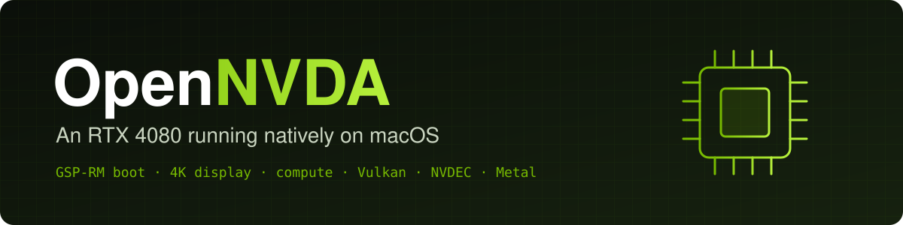
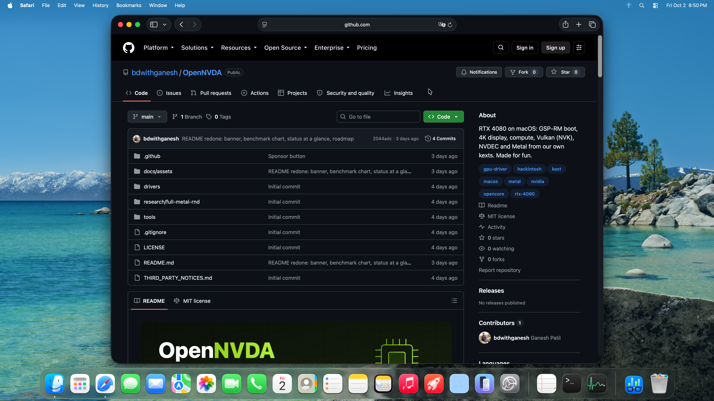
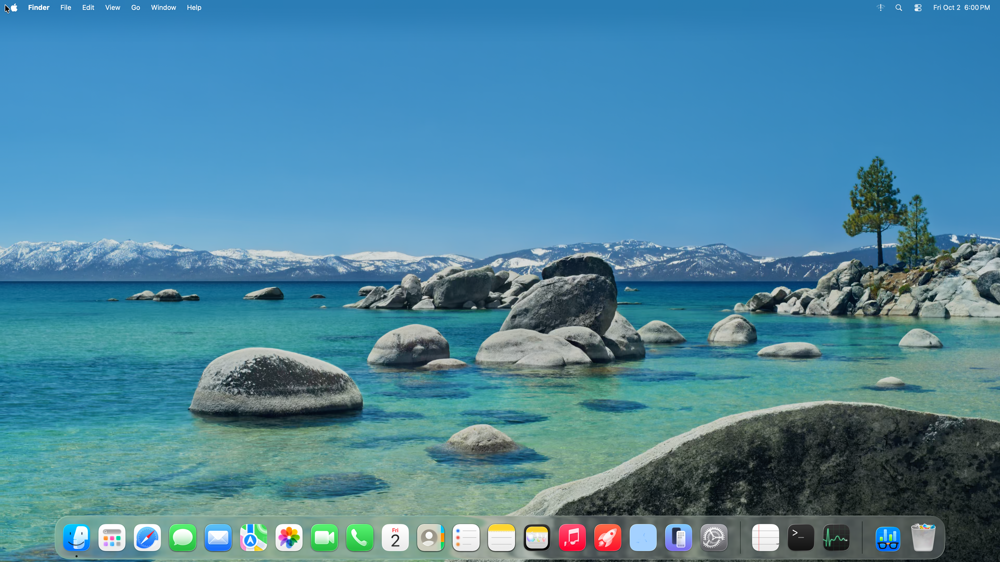
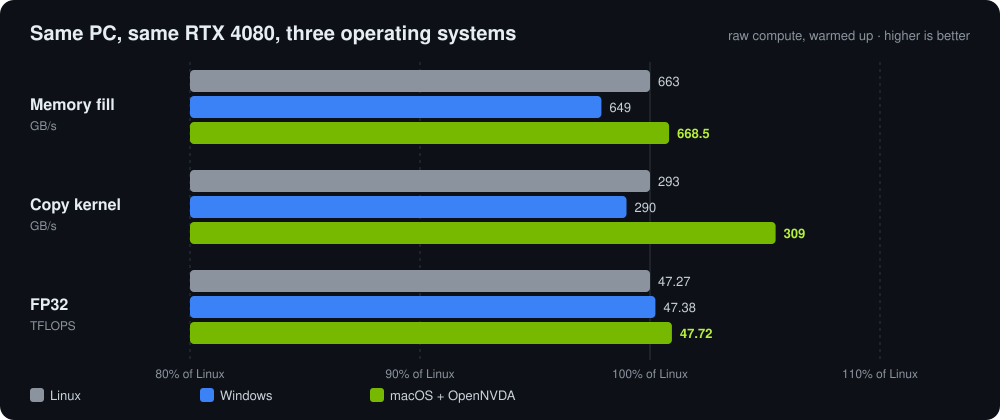
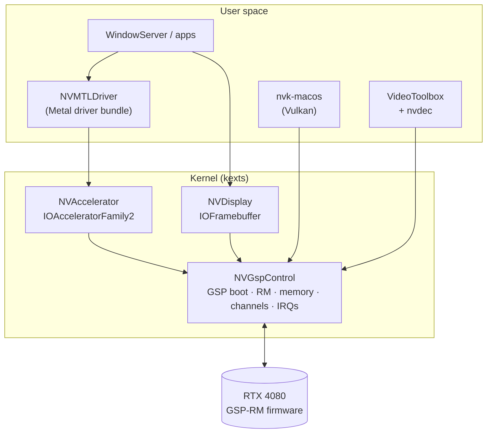

<div align="center">



<br>


-76B900?logo=nvidia&logoColor=white)


[](https://github.com/bdwithganesh/OpenNVDA/stargazers)

**RTX 4080 on macOS Tahoe: GSP-RM, an accelerated desktop, Metal and a lot of unfinished driver work.**
<br>
Not a framebuffer hack. Not a VM. Bare metal.

[What works](#-what-works-today) · [Numbers](#-the-numbers) · [How it fits together](#-how-it-fits-together) · [Build](#-building) · [Support](#-want-this-to-become-a-real-driver) · [Credits](#-credits)

<a href="https://www.buymeacoffee.com/bdwithganesh"></a>

</div>

> [!NOTE]
> **Made for fun**, on one PC, by one person with a lot of reboots. It's not a product and it's not ready for your daily machine. If you'd like it to become a real driver, [here's how you can help](#-want-this-to-become-a-real-driver).

## 🤔 Why this exists

Apple never shipped a driver for any NVIDIA card newer than Kepler. From Mojave onwards there's nothing at all. On a modern Hackintosh an RTX card is dead weight, or at best a dumb framebuffer sitting on the firmware's GOP screen.

We wanted to see how far one person could actually push it. Turns out, pretty far.

## ✅ What works today

The current test machine runs Tahoe 26.7. This is the 2 October 2026 checkpoint, not a release.

| Part | Tested setup |
|---|---|
| **Board** | MSI X870E GAMING PLUS WIFI |
| **CPU** | AMD Ryzen 9 7950X |
| **GPU** | NVIDIA GeForce RTX 4080 16 GB (AD103, Ada Lovelace) |
| **OS / firmware** | macOS Tahoe 26.7 / NVIDIA GSP-RM r570.144 |
| **Installed stack** | NVGspControl 0.178.27, NVAccelerator 0.5.17, NVMTLDriver 0.8.69, NVDisplay 0.9.6 |
| **Published control source** | 0.178.29; host checks and kernel SDK build pass, not installed on the test machine yet |

#### 🟢 Checked on the machine

- **Accelerated desktop at 4K60.** WindowServer stays up; the screenshots below show Finder and Safari frames captured from the real scanout surface.
- **Focused Metal tests:** 39 different cases pass. The separate depth/stencil test passes all 75 checks. These are useful regression checks, not full Metal conformance.
- **Output LUT effect:** with one fixed gray-ramp input, identity → half gain → identity changes the raster and DisplayPort CRCs, then returns exactly to the original values. The compositor CRC stays the same. Raw receipts are in [the evidence folder](docs/evidence/2026-10-02/README.md).

#### 🟡 Working, still being checked

- **Metal and WindowServer** run, but app coverage and long-session stability are incomplete.
- **Shared-channel recovery** passed an earlier 600-second checked workload on control 0.178.25. It has not been repeated on the current display checkpoint.
- **Cursor programming** can reach the actual enabled hardware state under a controlled normal composition/LUT pipeline. That has not proved that the cursor bitmap reaches the output. Production still uses the software cursor.
- **NVK, NVDEC and low-level compute** have earlier focused results. This update includes their source; it does not claim a fresh full Vulkan or video qualification run.

#### 🔴 Still blocking a release

- **Hardware cursor output:** CRC capture stops completing when the test cursor is enabled. PIO channel setup and point initialization did not fix it. The failed logs are published too.
- **Private-channel recovery:** a post-reset mixed workload failed with RC109. Shared containment stays in place.
- **Real app compatibility:** Geekbench 7 Metal Background Blur aborts on an unsupported AIR typed load. The bounded OpenCL run did not finish either; there is no completed score.
- **Direct scan-out, production gamma controls, calibrated colour, HDR/VRR, sleep/wake, all-day use and installation qualification** remain open. The code and the screenshots do not establish Apple parity.

### A couple of actual frames

[](docs/evidence/2026-10-02/safari-on-tahoe.png)

Safari on the target at 20:50 IST, after the unchanged-driver reboot and the 39-case Metal / 75-check depth tests. It shows the OpenNVDA page as it existed before this push.

[](docs/evidence/2026-10-02/desktop-after-lut.png)

Desktop at 18:00 IST after the LUT trials and restoration. Both images are original 3840×2160 framebuffer captures. They show rendered desktop frames and the software pointer; separate hardware cursor and LUT stages are not captured by this method. [Logs, CRC values, hashes and what each result actually proves](docs/evidence/2026-10-02/README.md).

## 📊 The numbers

<div align="center">

</div>

<br>

| Test | Linux (NVIDIA 570) | Windows (NVIDIA) | **macOS + OpenNVDA** |
|---|---:|---:|---:|
| GPU memory fill | 663 GB/s | 649 GB/s | **668.5 GB/s** |
| GPU copy kernel | 293 GB/s | 290 GB/s | **309.0 GB/s** |
| FP32 compute | 47.27 TFLOPS | 47.38 TFLOPS | **47.72 TFLOPS** |
| Host ↔ GPU (pinned / shared) | 26.9 / 26.4 GB/s | 26.8 / 26.4 GB/s | 26 GB/s |

These are earlier same-card low-level measurements. They were not rerun for the 2 October Tahoe checkpoint; use them as reference numbers, not a current app-performance claim.

> [!IMPORTANT]
> These numbers come from our low-level runtime (`nvrun` + NAK shaders), not from Metal apps. Metal on top is much younger. The earlier Metal measurements were about **3.2 TFLOPS** for tiled SGEMM and **50 µs** dispatch latency. App correctness, recovery and the performance gap all still need work.

<details>
<summary><b>How these were measured</b></summary>

<br>

- **Setup:** same PC, same card, booted into each OS in turn.
- **Linux and Windows:** NVIDIA's official driver.
- **macOS:** OpenNVDA with `nvrun` and the gold kernels from `macos-lab-tools` (`nvrun`, `bench`, `nakc/kernels`).
- **Warm-up:** every run is warmed up so the GPU is at its boost clock. A cold short run on macOS gave 42 TFLOPS, only because the clock hadn't ramped yet.

</details>

## 🧩 How it fits together



<details>
<summary><b>What's in each folder</b></summary>

<br>

| Folder | What it is |
|---|---|
| `drivers/NVGspControl` | The main kext. Boots GSP, owns RM, memory, channels, interrupts, the display engine, sleep/wake |
| `drivers/NVGspCore` | Header-only core shared by the kexts and the host tests (ABI structs, boot staging, VA arena, heap) |
| `drivers/NVDisplay` | IOFramebuffer driver on top of NVGspControl, the thing WindowServer talks to |
| `drivers/NVAccelerator` | IOAcceleratorFamily2 accelerator, the kernel half of Metal |
| `drivers/NVMTLDriver` | Metal driver bundle, the user half of Metal |
| `drivers/nvdec` | H.264 and HEVC decode on NVDEC |
| `drivers/nvenc` | NVENC encode, early |
| `drivers/NVVTDecoder` | VideoToolbox decoder plug-in (parked experiment) |
| `drivers/nvk-macos` | Mesa's NVK Vulkan driver, ported to run on our kext |
| `drivers/NVFramebuffer` | The first framebuffer kext, only scans out the GOP surface. Kept as a fallback |
| `drivers/NVFBProbe` | The early probe that measured BARs, console and VBIOS before anything real existed |
| `research/full-metal-rnd` | Notes and experiments on the road to full Metal |
| `tools/gen_booter_unload.py` | Makes the one NVIDIA firmware header the kext needs, from your own linux-firmware copy |

</details>

## 🛠 Building

You need MacKernelSDK and a workspace from `macos-lab/workspace.sh`, which links `drivers/NV*` into the layout the build script expects:

```sh
python3 tools/gen_booter_unload.py /path/to/linux-firmware/nvidia/ad103/gsp/booter_unload-570.144.bin
# Supply your own firmware inputs to tools/nvgsp_package.py; see --help.
sh tools/build_kext.sh NVGspControl /path/to/MacKernelSDK [gsp-package.bin]
sh tools/build_kext.sh NVDisplay    /path/to/MacKernelSDK
```

> [!CAUTION]
> **No NVIDIA firmware is in this repo, and none ever will be.** GSP-RM, the booters and the VBIOS belong to NVIDIA. You take them from linux-firmware or your own NVIDIA driver install, and `nvgsp_package.py` packs them for the kext.

Run the hardware-free source checks with `sh tests/run_host_checks.sh`. They exercise the actual driver/probe code against mocks and check the shared core helpers. This does not load a driver. Other tests live next to each part:
- `drivers/NVGspControl/tests`
- `drivers/nvdec/tests/*/run.sh`
- `drivers/nvk-macos/tests/nvkmd_macos/run.sh`

## ⚠️ Before you try it

- It's written for **one** card (AD103) on **one** board. Other Ada cards might get somewhere; anything older won't.
- You need:
  - our OpenCore setup;
  - SIP and authenticated root turned off;
  - a second OS you can boot when a test goes wrong.
- A bad GPU state can hang the machine until a cold reboot. Back up your data. We're not responsible for what happens to your machine.
- Not affiliated with NVIDIA or Apple. All trademarks belong to their owners.

## 🗺 Roadmap

- [x] GSP-RM boot, display, ReBAR, write-combining, power states
- [x] Compute, copy engines, Vulkan (NVK), NVDEC
- [x] Metal basics, WindowServer on our GPU
- [ ] Stable login session on the native Metal path
- [ ] Direct scan-out flips (no CPU copy)
- [ ] Metal apps at the same speed as the raw numbers
- [ ] Hardware cursor output, sleep/wake, private-channel GPU reset recovery
- [ ] Production gamma controls and calibrated display validation
- [x] macOS Tahoe 26 basic bring-up and focused Metal checks
- [ ] Tahoe app coverage and long-session qualification
- [ ] PyTorch (MPS), then MLX, on the RTX

## ☕ Want this to become a real driver?

Right now it's a hobby: nights and weekends on one PC. To turn it into something other people can install and trust, it needs:

- **time** (months, not weeks);
- **more cards to test on**: a 4070 or 4090, a 30-series;
- **a spare machine**, so one broken boot doesn't stop everything.

<div align="center">

<a href="https://www.buymeacoffee.com/bdwithganesh"></a>

</div>

Backers get their name in this README. If a company or a group wants to fund proper work (more cards, Tahoe support, a stable release), open an issue titled **"Funding"** and let's talk.

Even a ⭐ or a share helps. It tells us people actually want this.

## 🙏 Credits

**Built by [bdwithganesh](https://github.com/bdwithganesh).**

To be upfront: a lot of the code was written with AI help. The rest was me:
- the idea, and the stubbornness to keep going;
- every direction call;
- the hardware and every test on it: hundreds of reboots, Linux and Windows reference captures, reading logs at 3 am;
- deciding what "working" actually means.

This stands on other people's shoulders:

| Project | What we owe them |
|---|---|
| **nouveau** | Years of reverse engineering NVIDIA GPUs |
| **NVIDIA open-gpu-kernel-modules / open-gpu-doc** | Without these, GSP-RM would be a black box |
| **Mesa (NVK, NAK)** | The Vulkan driver and the shader compiler we build on |
| **envytools** | Register documentation |
| **acidanthera** | MacKernelSDK, Lilu, OpenCore |
| **WebKit** | The VideoToolbox SPI declarations |

Where our code follows one of them closely, the comment right there says so. Full list with licences: [THIRD_PARTY_NOTICES.md](THIRD_PARTY_NOTICES.md).

## 📄 Licence

MIT, see [LICENSE](LICENSE). Third-party files keep their own headers and licences.

<div align="center">
<sub>Made in India 🇮🇳, one reboot at a time.</sub>
</div>
